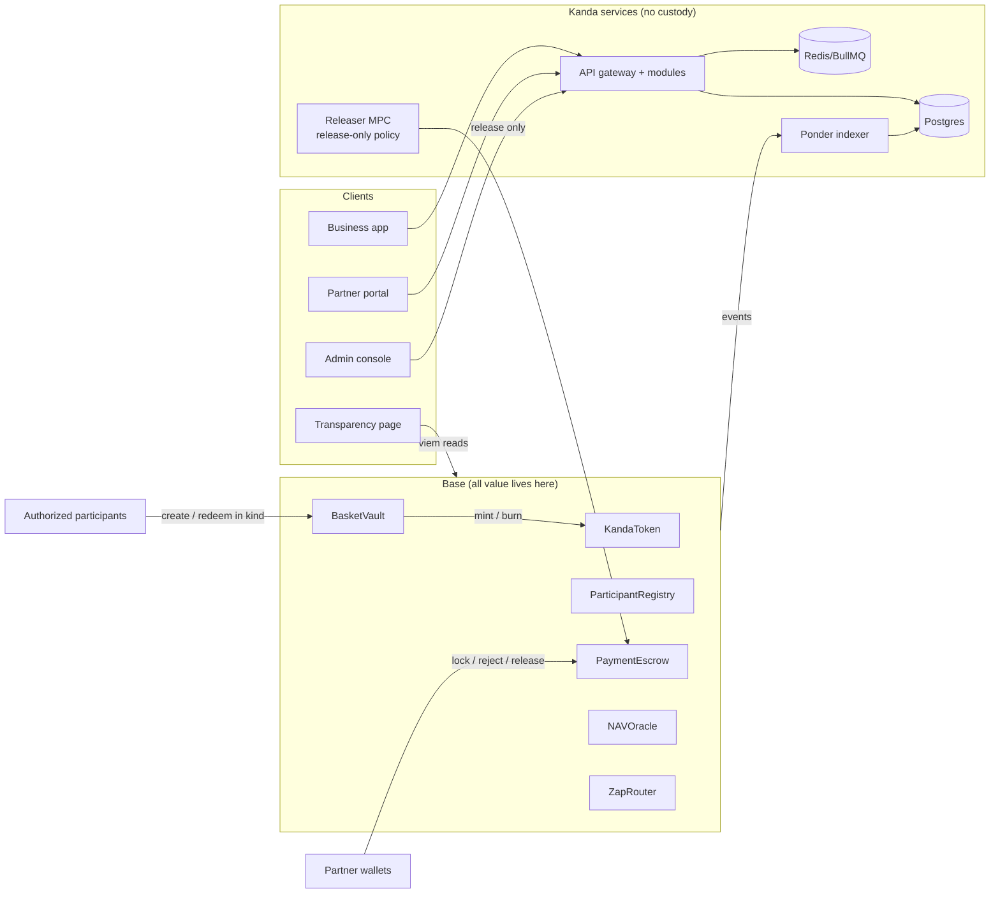
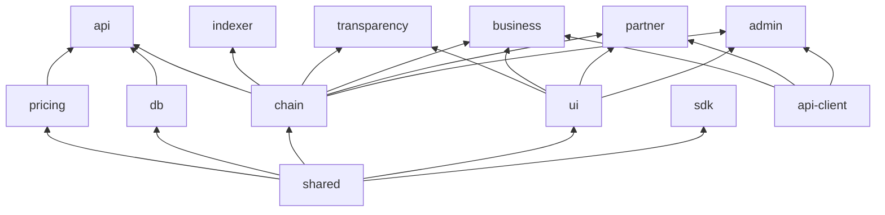

# Pre-implementation architecture review

27 Sep 2026 · Scope: all 18 tabs in `docs/` plus `AGENTS.md` · Status: partly decided, see section 8

This review is not a spec. `AGENTS.md` says "never add a contract function, API endpoint, table or state not in the spec; propose a spec change instead". This file is that proposal list. Each item names the task it blocks, so work can start where the spec is already sound and wait where it is not.

## 0. Summary

The spec is unusually build-ready. Invariants, the role map, error surfaces and the payment state machine are all written as tables, which lets us generate tests from them. The core design is sound: in-kind primary market, no oracle in the mint path, value only in contracts, a pause-only guardian. I found no problem with the economic model. I proved that the rounding rules preserve full backing, including fee-on-transfer gold (section 2).

The gaps sit at the seams between layers. The contract spec is close to complete. The backend spec (state machine, ledger, schema, indexer) has structural contradictions that would surface as bugs if coded literally.

**Can start now:** T0.2 KandaToken.

**Blocked on small spec edits:**

| Task | Needs |
| --- | --- |
| T0.3 Registry | SCP-02, SCP-03 |
| T0.4 Vault | SCP-01, SCP-03 |
| T0.6 Deploy | SCP-02, SCP-03, SCP-09 |

**Must be fixed before P1 backend tasks:**

| Task | Needs |
| --- | --- |
| T1.5 Schema | SCP-08, SCP-10 |
| T1.7 Indexer | SCP-10 |
| T1.8 Orchestrator | SCP-07 |
| T1.9 Ledger | SCP-06 |

Top findings, most consequential first:

1. **C-01 Pause granularity.** One token-level pause cannot do "pause create, keep redeem open", which ADD section 16 and runbook R5 both require. The vault and escrow interfaces have no pause functions at all.
2. **B-01 Ledger.** The per-asset balance trigger rejects the spec's own posting rules. Created debits USDC and PAXG and credits KND, so no posting ever balances per asset.
3. **B-02 State machine.** It is missing the maker/approver step, cancel, Travel Rule rejection, lock failure and timeouts. It also has no handling for chain events that arrive in "unexpected" off-chain states. The chain is the source of truth, so those events will happen.
4. **C-05 Expiry race.** After expiry, `release` and `refund` are both valid on a Locked intent. A receiving partner that pays fiat near expiry can lose the KND to a permissionless refund.
5. **B-04 Ponder finality.** A worker that flips `finalized` on rows Ponder owns conflicts with how Ponder rewinds on a reorg.
6. **C-02 / C-03 Role map.** The role map in ADD section 4 lacks `RELEASER_ROLE`, and nothing says how the registry learns the vault address. VerifyRoles would fail by construction.

## 1. System model, as I will build it

Trust boundaries I'll hold to in code:

- **Only contracts hold value.** The only Kanda key that can move funds is the releaser. Even a compromised releaser can only send a Locked intent's KND to that intent's registered receiver. The worst case is "Partner B is paid before paying fiat", not theft to an attacker. Bound that loss with MPC value caps (L7 section 2).
- **The API is not trusted by the things it instructs.** The releaser policy and the SDK should each verify independent evidence rather than trust the API (B-09).
- **Every off-chain transition is replayable from the chain plus `intent_events`** (L7 section 8). That shapes the orchestrator: it must be a pure function of (state, trigger), and every chain-driven trigger must be idempotent by `(chain_id, tx_hash, log_index)`.

## 2. Invariant analysis

INV-1 (full backing) is the invariant that matters most. I checked that the L1 rounding rules preserve it. Let q be a leg's qty per 1e18 KND, S the supply, and B the vault balance of that leg. Assume B ≥ ⌈S·q⌉ holds before each call.

**Create, including fee-on-transfer.**

1. The vault mints g = min over legs of ⌊rᵢ·1e18/qᵢ⌋, where rᵢ is the amount actually received for leg i.
2. So g·qᵢ ≤ rᵢ. Since rᵢ is an integer, ⌈g·qᵢ⌉ ≤ rᵢ.
3. Ceiling is subadditive, so ⌈(S+g)·q⌉ ≤ ⌈S·q⌉ + ⌈g·q⌉ ≤ B + r.

The fee is part of g, so it is backed too. INV-1 holds on create.

**Redeem.**

1. Supply falls by the net amount n (the fee stays in circulation), and the vault pays ⌊n·q⌋.
2. ⌈x⌉ − ⌊y⌋ = ⌈x⌉ + ⌈−y⌉ ≥ ⌈x − y⌉.
3. So B − ⌊n·q⌋ ≥ ⌈(S−n)·q⌉.

INV-1 holds on redeem.

Where INV-1 can still break, and how each is handled:

| Path | Status |
| --- | --- |
| `setBasket` | Guarded by the "already fully backed" check. Must use the same ⌈S·q⌉ form. |
| CashDesk (P2) | Changes the invariant's definition. Deferred. |
| Rebasing or negative-rebase reserve token | Excluded by token choice. Record this in ADR-010. |
| **Issuer freeze of the vault** (USDC or PAXG blacklist) | `balanceOf` is unchanged, so coverage still reads 100% while the reserves cannot be used. INV-1 on-chain cannot see this. Monitoring must watch issuer `Blacklisted`/freeze events for the vault address, not only balances (see L7 alert "freeze event touching vault"). |

INV-7 and INV-8 depend on C-01 being resolved, because "paused" has to mean something defined per contract.

## 3. Findings

Severity:

- **B**: blocks the named task.
- **H**: must be resolved before the P1 freeze or first use.
- **M**: clarify before the relevant task.
- **L**: minor, or a note.

### 3.1 Contracts (L1)

| ID | Sev | Finding | Recommendation |
| --- | --- | --- | --- |
| C-01 | B: T0.4, T1.1 | **Pause.** ADD section 16 (USDC depeg) and L7 R5 need "pause create, keep redeem". The only specified pause is on KandaToken, and `_update` reverts when paused, which also blocks the burn inside redeem. `IBasketVault` and `IPaymentEscrow` require "not paused" but declare no `pause`/`unpause`, and don't say whose pause they check. | SCP-01 |
| C-02 | B: T0.3 | **Registry consumer.** `consumeCreate`/`consumeRedeem` are "only BasketVault or CashDesk", but nothing says how. The registry is deployed before the vault (L1 section 7, steps 3 and 4), so it can't take the vault as an initializer argument. | SCP-02: a role granted by WireRoles |
| C-03 | B: T0.6, T1.1 | **`RELEASER_ROLE`** is used in L1 section 3.4 and appears as a key in L7 section 2, but it's missing from the ADD section 4 role map. VerifyRoles checks against that map, so it would fail or silently omit the role. | Add it to the role map (SCP-02) |
| C-04 | B: T0.3, T0.4, T1.1 | **Errors and setters incomplete.** No errors for: unknown tier, fee > 100 bps, zero amount, zero address, `minAmountsOut` length mismatch, `resolve` with `toReceiver > amount`, invalid basket (empty, zero qty, duplicate asset, non-increasing version), invalid expiry bounds, rescuing KND, sender == receiver. No setter or event for escrow `minExpiry`/`maxExpiry`, though "set by timelock". `rescueERC20` is in the rules but not in `IKandaToken`. | SCP-03: one consolidated addition |
| C-05 | H | **Expiry race.** `release` checks only status Locked; `refund` is open to anyone after expiry. After expiry both succeed, and the first to be mined wins. If Partner B pays fiat late, a refund can front-run the release and Partner B is out of pocket. | SCP-04 (P1 off-chain): refuse payout confirmations after `expiry − buffer`; show a "do not pay after" deadline in the inbox and webhook. Decide in P2 whether to add a receiver-only grace window on-chain. |
| C-06 | H | **`intentId` encoding** is "keccak256 of the off-chain UUID and the chain id". The byte layout is undefined, and the backend, SDK, indexer and reconciliation must all agree on it byte for byte. | Define `keccak256(abi.encode(bytes16 uuid, uint256 chainid))` and use UUIDv7 for intents (SCP-04) |
| C-07 | H | **`metadataHash`** is defined twice. L1: canonical JSON of the Travel Rule and invoice payload. L4: the same plus a 32-byte salt. "Canonical JSON" is never specified. | Adopt L4's salted form plus RFC 8785 (JCS). Fix L1 to point to L4 section 4 (SCP-04). |
| C-08 | M: T1.2 | **NAVOracle.** L1 says `maxStaleness` and `maxDeviationBps` change by "redeploy", while ADD gives `ORACLE_ADMIN_ROLE` "change feeds and thresholds" and L7 R3 says "switch secondary feed through timelock". It doesn't say where G and the USD leg come from (immutable, or read from `vault.legs()`). The state when both feeds are fresh but deviate beyond the bound is undefined: Ok needs agreement, and Degraded is defined as "one feed usable". | SCP-05. Recommendations: immutable config (redeploy, per L1); G read from `vault.legs()` so it can't drift after reconstitution; deviation breach means `Degraded` returning the primary. `navStrict` still reverts in that case, so the zap is protected either way. |
| C-09 | M: T1.3 | **ZapRouter** is under-specified. The `swapData` format and the aggregator are unnamed. How the router allowlist is managed isn't stated, and the contract is non-upgradeable. It says "effective price vs navStrict" without a formula. The zap consumes its own registry limits, so one user can exhaust the shared daily limit for everyone. | Specify before T1.3. The limit-sharing is acceptable under the P1 caps but should be written down. |
| C-10 | M | **`setBasket`** is in the P1 interface but its logic is P3 (T3.2). It adds audit surface now. There is also no way to recover the surplus of a retired leg (P3 reconstitution) or fee-on-transfer excess. | Ship the P1 vault without `setBasket` (genesis basket set in the initializer). Add it with the P3 upgrade and a surplus policy. **Decided: deferred (ADR-012).** |
| C-11 | L | `coverage()` with `totalSupply == 0` divides by zero. | Return `type(uint256).max` and document it |
| C-12 | L | Escrow exit paths: should release, reject and resolve re-check the registry? If they do, deactivating a partner traps funds. | Don't re-check the registry on exit paths. The token blocklist already freezes deliberately, which is the only intended trap. |
| C-13 | L | `batchRelease` (P2) is in the P1 interface. | Leave it out of the P1 interface. Escrow is UUPS, so it can be added in P2. |
| C-14 | L | Redeem fee rounding isn't specified. A blocked fee recipient makes every create and redeem revert. | Round up, against the user. Treat the fee recipient as a Safe that is never blocked, and note it in L4 section 7. |
| C-15 | L | CCIP's `IBurnMintERC20` also expects `burn(address,uint256)`, which `IKandaToken` lacks. | Add it in the P2 upgrade. Don't claim CCIP compatibility in P1. |
| C-16 | L | EIP-3009 isn't in OpenZeppelin, so it's custom code in audit scope. | Follow Circle FiatToken v2 semantics, with a nonce space separate from permit. |

Implementation notes (no spec change needed):

- OZ `_update` can't see the spender, so "blocked spender on transferFrom" needs a check in `transferFrom` or `_spendAllowance`.
- `consumeCreate` should consume `kndGross` (the actual amount). `consumeRedeem` should consume the gross `kndAmount`.
- The transient reentrancy guard has no storage, so it's safe behind UUPS proxies.

### 3.2 Oracles and pricing (L2)

| ID | Sev | Finding | Recommendation |
| --- | --- | --- | --- |
| O-01 | M: T1.10 | **Rounding.** "Round against the customer by at most one base unit" can't hold if each step of R = (S − F_A)/r_A · (1 − f_net) · r_B − F_B rounds separately. | Evaluate the formula as an exact bigint rational (numerator/denominator), round once at the end, and add a property test that the result is within one unit of the exact value. |
| O-02 | L | **Side.** "r_A is Partner A's KES per KND (buy)": buy from whose side? | Name fields by who pays. `sendPerKnd` is the local units the customer pays per KND; `receivePerKnd` is the local units the beneficiary gets per KND. |
| O-03 | L | **Quote validity.** Partner quotes are valid 60 s, but customer quotes are locked 10 min and "partners must honor". The partner carries about 9 minutes of FX risk. | Commercial term for the P0 partner agreement, not code |
| O-04 | M | **Gold source.** The gold token and gold feed on Base are open (ADR-010). If there is no adequate gold token on Base, L1 says the vault moves to Ethereum mainnet, which restructures L1 and L3. | **Decided: DGLD with Chainlink XAU/USD primary and PAXG/USD secondary (ADR-010).** Consequences in section 8. |

### 3.3 Backend and ledger (L3)

| ID | Sev | Finding | Recommendation |
| --- | --- | --- | --- |
| B-01 | B: T1.9 | **The ledger contradicts its own trigger.** The trigger rejects any transaction whose debits and credits differ per asset. But Created debits `vault:reserve:USDC` and `vault:reserve:PAXG` and credits `knd:supply`, three assets that never net to zero individually. The Released "memo to partner:B:received" has no balancing leg. The asset for fee accrual (KND or local currency) is unspecified. "Ledger split postings" for Resolved are missing from the posting table. | SCP-06: multi-asset ledger with per-asset conversion (trading) accounts, the standard technique for multi-currency books. Full posting table in section 4. |
| B-02 | B: T1.8 | **State machine gaps.** (a) No pre-approval state: FR-WAL-01 and L5 need maker/approver with a two-person rule, and L6 has no approve endpoint. (b) `POST /payments/{id}/cancel` has no transition. (c) L4 blocks lock until Travel Rule is accepted, but there's no transition for Travel Rule rejection. (d) FUNDED and LOCKING have no timeout. LOCKING has no failure path (guard mismatch, reverted tx, never submitted). (e) Chain events can arrive in any state where the on-chain status is still Locked: Partner A may `release` early, a `dispute` can land in PAID_OUT, a refund after expiry can land in PAID_OUT or RELEASING (C-05). (f) Nobody is named to submit the refund after expiry: the MPC policy is release-only. (g) The CONFIRMED to AWAITING_FUNDS guard should read "screening clear". (h) `reject` is receiver-signed on-chain, but there's no endpoint returning reject calldata. (i) The diagram caption ("5 main, 5 exceptional") doesn't match the table (8 main), and the diagram wasn't exported. | SCP-07 (proposed table in section 4) |
| B-03 | B: T1.5 | **Tables used by the spec but missing from the schema:** `recon_breaks` (L3 section 8); beneficiaries (L5, L6); webhook endpoints and deliveries (L6, L5 Developers); audit log (L3 section 3, L5); `nav_snapshots` (L2 section 2); FX reference observations and regime (L2 section 3); approval policies (L5 Team); partner statements (L6); files and invoices (`fileId`, L6); API credentials with two active secrets (L6 section 2; `partners` holds only one); tx submitter nonces and transactions (L3 section 11); authorized participants (L5 admin); WebAuthn credentials; held-quote approvals; integrator principals (L6 names "integrator" as a caller, but `partners.kind` is only `ramp`/`market_maker`). | SCP-08: schema addendum, reviewed as one change |
| B-04 | H: T1.7 | **Ponder vs `onchain_events.finalized`.** Ponder owns and rewinds its own tables. A separate worker updating `finalized` on those rows, or Ponder writing into an app-owned table, breaks either Ponder's reorg handling or the "never acted on" guarantee. | SCP-10: no mutable `finalized` flag. The orchestrator reads Ponder tables where `block_number <= safe head` (or finalized head for large releases) and records `(chain_id, tx_hash, log_index)` as consumed inside its own transition transaction, which gives exactly-once. The reorg test in L3 section 12 then tests exactly this. |
| B-05 | M | **Finality is stated three ways.** ADD section 6: "L1 batch posting above threshold, 12 blocks otherwise". L3 section 6: "safe block; finalized above 25k USD". P1: "12 blocks; L1 batch inclusion above 25k". On the OP stack, safe means L1 batch inclusion and finalized means L1 finality (about 15 min or more). | Adopt AGENTS/L3 (safe; finalized above threshold) and fix ADD and P1. The USD threshold needs a defined NAV snapshot at event time. |
| B-06 | M | **NFR-03** ("lock to release p95 < 60 s on-chain") includes Partner B's fiat payout and two finality waits, so it can't be measured as written. | Redefine as submission to safe inclusion per transaction, plus payout confirmation to release submitted. |
| B-07 | L | The webhook envelope needs a per-intent `sequence`. | Use `payment_intents.version`. It's already incremented in the same transaction, so no schema change is needed. |
| B-08 | M | `corridors.max_intent_usd numeric(20,2)` and `quotes.*_minor numeric(38,0)` break the AGENTS rule of numeric(78,0) base units. | numeric(78,0) in minor units everywhere (SCP-08) |
| B-09 | M | **Releaser trust.** The MPC policy "re-checks against the API", which is the component we're defending against. A compromised API could also build lock calldata with the wrong receiver. | The policy should verify Partner B's own HMAC-signed payout confirmation, persisted verbatim. The SDK should decode lock calldata and check it against the payment before signing. |
| B-10 | L | **IDs.** The DB uses uuid, the API uses prefixed ids (`pay_`, `ptn_`, `bnf_`, plus `bus_` in an example but not in the list), and quotes use ULID text. | UUIDv7 in the DB. API id = prefix + Crockford base32 of the 16 bytes. Register every prefix in `@kanda/shared`. |
| B-11 | L | Behaviour when the same `Idempotency-Key` arrives while the first request is still in flight is undefined. | Return 409 with a new code `idempotency_in_progress` |

### 3.4 Compliance (L4)

| ID | Sev | Finding | Recommendation |
| --- | --- | --- | --- |
| K-01 | H | **Residency.** One Africa region (for example Cape Town) may not satisfy Kenyan and Nigerian residency rules. | Put all PII access behind a repository that routes by country and region key from day one (`pii_key_id` already exists), so a regional split is config rather than a migration. |
| K-02 | M | **The Travel Rule gate on lock is off-chain only.** An active partner can call `lock` directly. | Accept this and document it. Kanda withholds calldata and `metadataHash`, reconciliation flags orphans, and the receiver rejects. |
| K-03 | L | The log-scrubber test is only as good as the scrubbing method. pino `redact` is a denylist. | Use allowlist serializers for request and domain objects |

### 3.5 Partner API (L6) and cross-document

| ID | Sev | Finding | Recommendation |
| --- | --- | --- | --- |
| A-01 | H: T1.13, T1.14 | **Endpoints the apps need but L6 omits:** payment approval, reject and refund calldata, held-quote approval, beneficiary list, team and approval policy, every admin console endpoint, and indexer history for the transparency page. L5 forbids hand-written fetch, so without these the apps can't be built. | One OpenAPI document tagged `public`, `partner`, `business`, `admin`, with `admin` hidden from published docs. Record it as a spec decision. |
| A-02 | L | The integrator auth model is undefined. | HMAC like partners, as a separate principal kind (see B-03) |
| X-01 | B: T0.6 | **The config schema** (L1 section 7) lacks values Deploy needs: tier limits, min/max expiry, NAV staleness and deviation, pause-bot, releaser and fee-recipient addresses, zap router allowlist, gold decimals. | SCP-09. The scaffolded `config/*.json` holds only the specified fields. |
| X-02 | L | No licence was chosen. | **Decided: MIT (ADR-013).** |

## 4. Spec change proposals

Each goes into the named tab per Build Playbook section 6, with an ADR row where it changes a decision.

**SCP-01: pause model** (ADD section 4 and section 16, L1 sections 3.3 and 3.4, L7 R5)

- KandaToken pause stays "stop the world".
- BasketVault and PaymentEscrow each inherit `PausableUpgradeable` with `pause()` (PAUSER_ROLE) and `unpause()` (UNPAUSER_ROLE).
- BasketVault adds `pauseCreate()` and `unpauseCreate()`, which gate `createInKind` only.
- R5 becomes: `pauseCreate` on the vault, and no token pause.
- INV-7 is restated per contract.

**SCP-02: roles** (ADD section 4, L1 sections 3.2 and 7)

- Add `RELEASER_ROLE` (holder: MPC releaser).
- Add `LIMITS_CONSUMER_ROLE` (holder: BasketVault; CashDesk in P2).
- WireRoles grants both, and VerifyRoles checks them.

**SCP-03: error and setter catalogue** (L1 section 3). Add these errors:

- `UnknownTier(uint8)`
- `FeeTooHigh(uint16)`
- `ZeroAmount()`
- `ZeroAddress()`
- `LengthMismatch()`
- `InvalidSplit(uint128 toReceiver, uint128 amount)`
- `InvalidBasket()`
- `InvalidExpiryBounds()`
- `CannotRescueKnd()`
- `SameParty()`

Also add:

- `setExpiryBounds(uint64 minExpiry, uint64 maxExpiry)` with `ExpiryBoundsSet`, under LIMITS_ADMIN_ROLE (timelock).
- `rescueERC20` in `IKandaToken`, with `Rescued`.

**SCP-04: identifiers and hashes** (L1 section 3.4, L4 section 4, L3 section 5)

- `intentId = keccak256(abi.encode(bytes16 uuidv7, uint256 chainid))`.
- `metadataHash = keccak256(JCS({ivms101, invoiceRef, salt}))`. RFC 8785 is the canonical form, and L4's field list is normative.
- A payout-confirmation cutoff of `expiry − 30 min` (placeholder), enforced by the API and shown in the partner inbox.

**SCP-05: NAVOracle** (L1 section 3.5, ADD section 4)

- Thresholds and feeds are immutable; changing them means a redeploy plus a role change.
- Drop "change feeds and thresholds" from `ORACLE_ADMIN_ROLE` for P1 (it keeps FXReferenceOracle in P2).
- G and the USD leg are read from `vault.legs()`.
- A deviation breach means Degraded, returning the primary.

**SCP-06: multi-asset ledger** (L3 section 7). Add per-asset `conversion:{asset}` accounts, which net to zero across assets at NAV only for reporting. Every posting then balances per asset, and the trigger stays as written.

| Event | Asset | Debit | Credit |
| --- | --- | --- | --- |
| Created | USDC | `vault:reserve:USDC` | `conversion:USDC` |
| Created | PAXG | `vault:reserve:PAXG` | `conversion:PAXG` |
| Created | KND | `conversion:KND` | `knd:supply` |
| Created (fee) | KND | (inside the above) | memo: `revenue:vault_fees` via `knd:fee_recipient` |
| Redeemed | all | the Created rows reversed | |
| Locked | KND | `escrow:locked` | `partner:A:committed` |
| Released | KND | `partner:A:committed` | `escrow:locked` |
| Released (memo) | KND | `memo:partner:B:received` | `memo:contra` |
| Resolved | KND | `partner:A:committed` (full amount) | `escrow:locked` |
| Resolved (memo) | KND | memo pair for the receiver's share | |
| Fee accrual | the send currency, stated explicitly | `partner:A:fees_receivable` | `revenue:network_fees` |

**SCP-07: payment state machine** (L3 section 5, L6 section 3). Proposed additions to the transition table. The existing rows stay.

| From | Trigger | To | Guard |
| --- | --- | --- | --- |
| (new) | Maker submits locked quote | PENDING_APPROVAL | Quote locked, not expired |
| PENDING_APPROVAL | Approver approves (step-up) | CONFIRMED | Approver ≠ maker when policy says so; quote not expired |
| PENDING_APPROVAL | Quote expires, or maker cancels | CANCELLED | |
| CONFIRMED | Screening clear | AWAITING_FUNDS | (replaces the implicit trigger) |
| AWAITING_FUNDS | Business cancel | CANCELLED | |
| FUNDED | Travel Rule rejected or expired | CANCELLED (fiat return owed by Partner A; case opened) | |
| FUNDED | No lock within N h | FUNDED + ops case (no automatic cancel while fiat is held) | |
| LOCKING | Lock not seen within T, or tx reverted | FUNDED | |
| LOCKING | Locked, but amount, receiver or hash mismatch | LOCK_MISMATCH (ops case; receiver rejects) | |
| any on-chain-Locked state (LOCKED, PAID_OUT, RELEASING, REFUNDING) | Released, finalized | COMPLETED | Chain wins; flag if the source state was LOCKED |
| same set | Refunded, finalized | REFUNDED | Chain wins; P1 case if the source state was PAID_OUT |
| same set | Disputed | DISPUTED | |
| LOCKED | Payout confirmation after the cutoff | rejected with `invalid_state` | |

Also:

- REFUNDING submitter: a permissionless keeper key that can call only `refund`. Add it to L7 section 2.
- New endpoints:
  - `POST /payments/{id}/approvals`
  - `GET /partner/payments/{id}/reject-transaction`
  - `GET /partner/payments/{id}/refund-transaction`

**SCP-08: schema addendum** (L3 section 4). The tables in B-03, plus B-08 types, B-10 ids, and `payment_intents.travel_rule_status`. The `admin` API surface comes under A-01.

**SCP-09: network config schema** (L1 section 7). Add the fields listed in X-01.

**SCP-10: finality consumption** (L3 sections 4 and 6). Remove `onchain_events.finalized` and add `consumed_chain_events(chain_id, tx_hash, log_index, intent_id, consumed_at)`. Finality is computed at read time against the safe or finalized head.

**SCP-11: KandaToken EIP-3009 surface and details** (L1 section 3.1). Found while implementing T0.2 on 28 Sep 2026. Approved and applied on 28 Sep 2026 (section 8).

- Add the EIP-3009 events the standard requires: `AuthorizationUsed(address indexed authorizer, bytes32 indexed nonce)` and `AuthorizationCanceled(address indexed authorizer, bytes32 indexed nonce)`.
- Add errors: `AuthorizationNotYetValid()`, `AuthorizationExpired()`, `AuthorizationUsedOrCanceled(address authorizer, bytes32 nonce)`, `InvalidSignature()`, `CallerMustBePayee(address caller, address payee)`.
- State the rules the tests pin down. `blockAccount(address(0))` reverts `ZeroAddress`, because blocking zero would stop every mint and burn. `initialize(address admin)` grants only `DEFAULT_ADMIN_ROLE` and reverts `ZeroAddress` on zero. The name is `Kanda` (also the EIP-712 domain name, version `1`), the symbol `KND`. `approve` and `permit` still work while paused or blocked; only balance moves stop.
- Open for P2: Chainlink's `IBurnMintERC20` also declares `burn(address account, uint256 amount)`, which is not in `IKandaToken`. `BurnMintTokenPool` only calls `burn(uint256)`, so P1 is unaffected. Decide before the CCIP pool is chosen whether to add it or to use that pool type only.

## 5. Implementation strategy

**Order.** Follow the phase task packs strictly:

1. T0.2 now.
2. T0.3 and T0.4 once SCP-01 to SCP-03 are merged.
3. T0.5 invariants.
4. T0.6 deploy.
5. T0.7 transparency.

The payment and ledger work in P1 waits for SCP-06 to SCP-10. These are quick edits, but they must land in the spec first so reviews stay spec-vs-diff (Build Playbook section 1).

**Contracts.**

- Write `src/interfaces/I*.sol` verbatim from the spec first, then have each contract inherit its interface. Spec drift becomes a compile error.
- ERC-7201 namespaces are `kanda.storage.<Contract>`.
- Role constants live in `governance/Roles.sol`.
- Tests are generated from the spec tables:
  - one test per (function × role),
  - one per listed error,
  - one per event,
  - one per invariant.
- Test names: `test_<fn>_<condition>`, `testFuzz_…`, `invariant_INV1_fullBacking`.

**Backend.**

- Money is `{ amount: bigint; asset: AssetCode }`, with a single asset registry (KND 18, USDC 6, PAXG 18, KES 2, NGN 2, USD 2), and decimal-string parse and format without floats. ESLint already bans `parseFloat` and `toFixed`.
- The state machine is a `const` transition table plus a pure `transition(state, trigger)`.
- One `applyTransition(tx, intentId, expectedVersion, trigger)` does the version-checked update, the `intent_events` insert and the outbox insert.
- Tests iterate the table: every row is accepted, and every (state, trigger) pair not in the table is rejected.
- Append-only is enforced by the database, not by convention. A migration creates the app role with no UPDATE or DELETE on `ledger_*` and `intent_events`, and a test asserts that UPDATE fails.

**Package graph.** This is already declared in the workspace manifests.

**Scaffold choices not named in the spec (please ratify):**

- Soldeer for Solidity dependencies, instead of git submodules.
- Vitest.
- ESLint flat config with typescript-eslint `strictTypeChecked`.
- Prettier.
- pnpm catalogs.
- TypeScript held at 6.0.x, because typescript-eslint doesn't support TS 7.
- Proposed for property tests: fast-check. L2 section 6 and L3 section 13 ask for property tests but don't name a tool.

## 6. Decisions needed from you

| Decision | Blocks | My recommendation |
| --- | --- | --- |
| Approve SCP-01 to SCP-03 and SCP-09 | T0.3, T0.4, T0.6 | **Approved and applied** |
| Approve SCP-04 to SCP-08 and SCP-10 | P1 backend (T1.1, T1.5 to T1.9) | As written; I can draft the tab edits |
| Ship `setBasket` in P1, or defer to P3 (C-10) | T0.4 | **Deferred (ADR-012)** |
| Code licence (X-02) | Source verification on Base Sepolia (T0.6) | **MIT (ADR-013)** |
| ADR-010 gold token on Base, and the gold feed (O-04) | P1 contract freeze, not P0 | **DGLD; XAU/USD and PAXG/USD (ADR-010)** |
| ADR-009 MPC provider | T1 submitter adapter only | Defer; the local signer covers dev |

## 7. Scaffold inventory (T0.1)

- Root: pnpm workspace with catalogs, Turborepo, strict `tsconfig.base.json`, ESLint with guardrails (no floats, no `console`, typed rules), Prettier, `.editorconfig`, `.nvmrc`, `.gitignore` (secrets, build output), `.env.example` exactly as the Build Playbook gives it.
- `contracts/`:
  - `foundry.toml`: the playbook profile plus dependency, storage-layout, fs-permission and fmt settings.
  - Soldeer pins: OZ 5.6.1, forge-std 1.16.2.
  - The L1 folder layout, `config/base-sepolia.json` and `config/base.json` (spec fields only, placeholder addresses), and `slither.config.json` (fails on high).
  - One toolchain smoke test proving EIP-1153 support. Delete it in T0.2.
- `apps/*` and `packages/*`: a manifest with the intended dependency edges, a tsconfig and a placeholder `src/index.ts`. `apps/mobile` is README-only until P2.
- `api/openapi.yaml`: conventions, security schemes, `Idempotency-Key`, and problem+json with the L6 section 7 codes. No paths yet (T1.14).
- `.github/workflows/ci.yml`: forge soldeer install, fmt check, build, test; pnpm format check, lint, typecheck, test. `.github/pull_request_template.md` with the Definition of Done.
- Verified locally: `forge fmt --check`, `forge build`, `forge test` (1 passed); `pnpm format:check`, `pnpm lint`, `pnpm typecheck`, `pnpm test` (13 of 13 packages).
- Not done yet:
  - CODEOWNERS: GitHub handles are unknown.
  - Slither and nightly invariant jobs: added with T0.2 and T0.5.
  - The initial commit.

## 8. Decision log

### 27 Sep 2026

Decisions:

- SCP-01, SCP-02, SCP-03 and SCP-09 were approved and applied to the spec: ADD section 4, INV-7, section 15 (ADRs 011 to 013) and section 16; L1 sections 3.1 to 3.4, 4, 5 and 7; L7 section 5 and R5.
- The edited L1 interfaces compile under solc 0.8.28.
- `setBasket` is deferred to P3 (ADR-012).
- Licence: MIT (ADR-013). The LICENSE copyright holder is "The Kanda Authors" until the legal entity exists.
- ADR-010 accepted: DGLD as the gold leg; Chainlink XAU/USD primary and PAXG/USD secondary. The addresses are in `contracts/config/base.json` and L2 section 2.

Findings from verifying ADR-010 on-chain, all on Base mainnet on 27 Sep 2026:

| ID | Sev | Finding | Handling |
| --- | --- | --- | --- |
| G-01 | H | **DGLD issuer powers.** The issuer can pause transfers, blacklist, and move a blacklisted holder's balance to its recovery address. That is a seizure path, stronger than a freeze. The token is also an upgradeable proxy. If the vault is blacklisted, INV-1 breaks visibly and redeem stops for every leg, including USDC, because redeem pays all legs. | Recorded in ADD section 16, L1 section 4 and L7 R5, with alerts on Paused, Blacklisted, RecoveryFromBlacklistedAddress and Upgraded. Commercial: seek a written acknowledgement from Gold Token SA of the vault's address and purpose. **Open question for P1:** should redeem pay the unaffected legs when a leg is frozen? Today's design (all legs or nothing) is simpler and keeps holders pro rata; changing it needs an ADR. |
| G-02 | M | **Unit** inferred as 1 DGLD = 1 troy oz (DEX price $4,330 against XAU $4,285). | Confirm in the issuer's terms before genesis. The gram conversion is written into L1 section 4. |
| G-03 | M | **Liquidity.** About 401 DGLD on Base (≈ $1.7M) across 1,097 holders; about 1,604 on Ethereum. The P1 cap needs about 70 DGLD, roughly 17% of Base supply. | Before T1.3 (ZapRouter), confirm how authorized participants source DGLD (issuer mint on Base, or a bridge; the mechanism is unconfirmed) and measure DGLD pool depth. |
| G-04 | M | **Premium.** DGLD traded about 1% above XAU/USD; PAXG/USD was 0.2% below XAU. | NAV prices gold at spot. ZapRouter's maxPremiumBps must cover about 0.3% (a 1% premium on a 30% leg), plus the swap cost. |
| G-05 | L | **Weekends.** XAU/USD follows precious-metals market hours but still posted a heartbeat update on Sunday. NAV stays Ok but holds its Friday price. | Acceptable: no price gates mint or burn. Noted in L2 section 2. |
| G-06 | L | **No permit.** DGLD has no EIP-2612 permit. | ADD section 5 updated: participants approve DGLD before createInKind. |

Still open: SCP-04 to SCP-08 and SCP-10. None of them blocks P0.

### 28 Sep 2026

Decisions:

- SCP-11 was approved and applied to the spec: L1 section 3.1 (the EIP-3009 events and errors, and the initialize, blocklist, spender and signature rules) and L1 section 3.9 (remote chains use `BurnMintTokenPool`, so no `burn(address,uint256)` is added).
- T0.2 KandaToken implemented against it.

