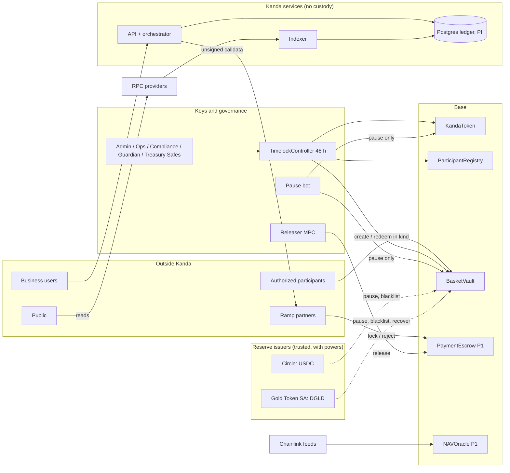

# Threat model v1

29 Sep 2026 · Scope: the P0 contracts deployed on Base Sepolia, and the P1 design in the specs · Status: draft for external auditor review (P0 exit gate, row 6)

This is the first threat model the P0 exit gate asks for. It lists what an attacker or a failure could take or break, what stops it, and what risk is left. L7 section 4 asks for a review at every phase gate, so P1 revises it before mainnet.

**Status** in the tables means:

- **Built**: in the code and covered by tests on `main`.
- **Specified**: in the spec, not built yet.
- **Open**: a gap or an undecided question. Each names what resolves it.

## 1. System and trust boundaries

**Assumptions.**

- Base orders transactions honestly but can go down. The sequencer is a liveness risk, not a safety risk.
- USDC and DGLD are trusted with the powers their issuers keep: pause, blacklist, and for DGLD, moving a blacklisted balance.
- Chainlink feeds can be stale or wrong, but no feed gates mint or burn.
- Anyone can read the chain and call any permissionless function.

## 2. Threats by boundary

### TB1 Contracts

| ID | Asset | Threat | Control | Status | Residual risk |
| --- | --- | --- | --- | --- | --- |
| T-01 | Reserves | A bug mints KND without backing | Only BasketVault holds MINTER_ROLE. The vault mints only against received balance deltas. Pulls round up, payouts round down (proof in the review, section 2). Invariants INV-1 to INV-3 pass at 10,000 runs, and planted bugs are caught (T0.5). | Built | Unknown bugs until the two P1 audits |
| T-02 | Reserves | A reserve token takes a transfer fee after an upgrade | Balance-delta accounting: the scarcest leg decides the gross mint, and any excess stays as surplus | Built | A token that changes balances without transfers (rebasing) would break INV-1. Excluded by token choice (ADR-010). |
| T-03 | Supply | A compromised participant mints a large amount | Supply cap (INV-2) and per-tier daily limits (INV-6), both invariant-tested | Built | Exposure up to the cap and one day's tier limit |
| T-04 | Holders | A pause is misused, or pauses too much | Separate token, vault and create-only pauses (ADR-011). Pausers can't unpause. The guardian is 2 of 4. | Built | Whoever holds a pause key can halt activity until the Admin Safe unpauses. They can't move funds. |
| T-05 | Holders | Replay of a permit or EIP-3009 signature, including on another chain | EIP-712 domain with the chain ID; nonces; used and cancelled authorizations stay spent | Built | None known |
| T-06 | Blocked holders | Abuse of the blocklist | Freezes only, no seize (L1 section 3.1). Blocking takes the 2-of-3 Compliance Safe, and events are public. L4 section 7 requires a legal basis. | Built (contract) / Specified (process) | Blocked funds stay frozen until unblocked, by design |
| T-07 | Upgrades | Storage collision in an upgrade | ERC-7201 namespaced storage; storage-layout diff in CI (L7 section 3) | Built (namespaces) / Open (CI diff) | Until the CI diff exists, a reviewer must compare layouts by hand |
| T-08 | Escrow | Race after expiry: `release` and `refund` are both valid, so a receiver that pays fiat late can lose the KND (C-05) | SCP-04: refuse payout confirmations after expiry minus a buffer; show a "do not pay after" time | Open (P1, T1.1 and T1.8) | Until SCP-04, a late payout can lose the receiver its KND |
| T-09 | Escrow | Escrow balance differs from the sum of open intents | INV-4 and INV-5 added to the invariant suite with PaymentEscrow | Specified (T1.1) | |
| T-10 | Reserves | Reentrancy through a token callback | ReentrancyGuardTransient on every token-moving function; checks, effects, interactions; no callback tokens as legs | Built | |

### TB2 Keys and governance

| ID | Asset | Threat | Control | Status | Residual risk |
| --- | --- | --- | --- | --- | --- |
| T-11 | Everything upgradeable | Admin Safe compromise leads to a malicious upgrade or role change | 3-of-5 hardware signers in two or more countries; 48-hour public timelock; guardian pause and Admin cancel (R2) | Specified. Testnet uses a 5-minute delay and 1-of-1 Safes. | The timelock protects only if someone watches the queue. The watch (alert R2) isn't built yet. |
| T-12 | Roles | The deployer keeps power after deployment | Deploy renounces every deployer role. VerifyRoles fails if anything differs from the map. A fresh deployer is used per deployment. | Built (verified on Base Sepolia) | |
| T-13 | Testnet roles | The testnet deployer key appeared in a chat transcript | Testnet only; never funded on mainnet. Mainnet uses a fresh hardware-wallet deployer at the key ceremony. | Accepted for testnet | Someone could interfere with the testnet deployment |
| T-14 | Testnet roles | One key controls all five test Safes (1-of-1) | Add signers in the ceremony dry run (key-ceremony.md, section 8) | Open | Testnet only |
| T-15 | Escrowed KND | Releaser key theft leads to early releases | MPC policy (L7 section 2): only `release`, only for PAID_OUT intents, value caps, two-person approval above a threshold | Specified (P1) | An attacker who controls both the API and the policy engine can release up to the caps |
| T-16 | Availability | Pause-bot key theft | Pause-only role; KMS or MPC custody; quarterly rotation | Specified | Denial of service until the Admin Safe unpauses |
| T-17 | Roles | A role is granted to an address outside the known set | VerifyRoles checks every known address. The indexer's RoleGranted watch covers the rest (L7 section 5). | Built (script) / Specified (watch) | AccessControl can't list members, so only the event watch sees unknown grantees |

### TB3 Reserve issuers

| ID | Asset | Threat | Control | Status | Residual risk |
| --- | --- | --- | --- | --- | --- |
| T-18 | Gold leg | The DGLD issuer pauses the token, blacklists the vault, or moves the vault's DGLD to its recovery address (G-01) | R5 runbook; alerts on Paused, Blacklisted, RecoveryFromBlacklistedAddress and Upgraded; written acknowledgement from Gold Token SA; P2 spreads the gold leg over two tokens | Specified (alerts, runbook) / Open (acknowledgement) | **High.** The issuer can seize the gold leg. Accepted in ADR-010 and disclosed. |
| T-19 | USD leg | USDC depeg, pause or blacklist | `pauseCreate` keeps redeem open (R5); alerts | Built (pauseCreate) / Specified (alerts) | A USDC blacklist of the vault stops redeem for every leg, because redeem pays all legs |
| T-20 | Basket | DGLD's unit is a gram, not a troy ounce (G-02) | Confirm in the issuer's terms before genesis; the gram formula is in L1 section 4 | Open | A wrong G mis-prices the whole basket |
| T-21 | Primary market | Participants can't source DGLD (G-03) | Confirm sourcing and pool depth before T1.3 | Open | Creation stalls |

### TB4 Oracles and pricing

| ID | Asset | Threat | Control | Status | Residual risk |
| --- | --- | --- | --- | --- | --- |
| T-22 | Mint path | Oracle manipulation mints or burns wrongly | No oracle is read in BasketVault (AGENTS.md "never"); create and redeem are in kind | Built | |
| T-23 | NAV and zap | Stale, deviating or sequencer-down feeds give a wrong NAV | Staleness, sequencer and deviation checks; Degraded state; zap disabled when not Ok | Specified (T1.2) / Open (SCP-05 decisions) | Wrong NAV on display, never in the mint path |
| T-24 | Customer prices | A partner quotes a manipulated rate | Reference-divergence holds; per-partner limits (L2 section 4) | Specified | |

### TB5 Kanda services

| ID | Asset | Threat | Control | Status | Residual risk |
| --- | --- | --- | --- | --- | --- |
| T-25 | Payments | Acting on an event later reorganised away | Act only after the safe block (finalized block above 25,000 USD); `consumed_chain_events` (SCP-10) | Open (SCP-10) | |
| T-26 | Payments | A retry submits a transaction twice | Idempotency keys on every POST; submitter idempotent by intent ID; nonce manager | Specified | |
| T-27 | Books | Ledger postings don't balance, or rows are edited | Append-only ledger and events; per-asset conversion accounts (SCP-06); daily reconciliation | Open (SCP-06) | |
| T-28 | Payments | State-machine gaps: no approver step, no cancel, chain events arriving in unexpected states (B-02) | SCP-07 transition table | Open (SCP-07) | |

### TB6 Partners and clients

| ID | Asset | Threat | Control | Status | Residual risk |
| --- | --- | --- | --- | --- | --- |
| T-29 | Partner API | Stolen credentials or replayed requests | HMAC over method, path, time and body; 300-second window; idempotency; optional mTLS and IP allowlist; overlapping secret rotation | Specified (L6 section 2) | |
| T-30 | Partner KND | Partner wallet compromise | The partner signs `lock` with its own key; Kanda never holds it; per-partner exposure limit of three times collateral | Specified | Loss up to the partner's exposure limit |
| T-31 | Business funds | Account takeover | OIDC plus WebAuthn step-up; maker and approver (SCP-07a) | Specified / Open (SCP-07) | |
| T-32 | Public trust | A malicious or faulty RPC makes the transparency page show false numbers | The page reads the chain at one block, and every number links to the explorer call. P1: two RPC providers, cross-checked. | Built (P0, single public RPC) / Specified (cross-check) | A reader who trusts one RPC can be misled |

### TB7 Data

| ID | Asset | Threat | Control | Status | Residual risk |
| --- | --- | --- | --- | --- | --- |
| T-33 | PII | Breach or leak | Compliance schema only; envelope encryption with per-region KMS; residency; no PII on-chain, in logs or in errors (AGENTS.md) | Specified | |
| T-34 | Operations | Insider abuse | SSO with hardware keys; four-eyes on sensitive actions; append-only audit log | Specified | |

### TB8 Supply chain and process

| ID | Asset | Threat | Control | Status | Residual risk |
| --- | --- | --- | --- | --- | --- |
| T-35 | Code | A malicious or compromised dependency | Exact pins: Soldeer checksums, pnpm lockfile and catalog. No install scripts (`onlyBuiltDependencies: []`). Frozen lockfile in CI. | Built / Open (audit, SBOM, signing: L7 section 3) | |
| T-36 | Code | Unreviewed code reaches `main` | Branch protection, required reviews, CODEOWNERS, signed commits (L7 section 3) | Open: CODEOWNERS not written, protection not confirmed, one person merges | A single account can change `main` |
| T-37 | Secrets | A key or secret is committed | `.env` and key files git-ignored; keys kept in `~/.kanda` outside the repo; secret scanning (L7 section 3) | Built (ignores) / Open (scanning) | |
| T-38 | Work | The developer's machine is lost (a crash corrupted the local repository on 29 Sep 2026) | Push after every task; GitHub holds the source of truth | Built (practice) | Unpushed work only |

### TB9 Public communication

| ID | Asset | Threat | Control | Status | Residual risk |
| --- | --- | --- | --- | --- | --- |
| T-39 | Brand | The name or ticker conflicts with an existing mark | Name clearance before public use (P0 exit gate, row 8) | Open | |
| T-40 | Users | Phishing clones of the token or the transparency page | Publish canonical addresses, verified sources and a token list; the brand release gate | Open (at P1 launch) | |

## 3. Largest residual risks

1. **DGLD issuer powers (T-18).** The issuer can pause DGLD or seize the vault's gold leg. Disclose it; get the written acknowledgement; diversify in P2.
2. **Unaudited contracts (T-01).** Nothing here replaces the two P1 audits and the bounty.
3. **Governance monitoring not live (T-11, T-17).** The 48-hour timelock only helps if the queue and role events are watched. Build the watcher (L7 section 9, task 3) before mainnet.
4. **Escrow expiry race (T-08).** Resolve SCP-04 before T1.8.
5. **Backend open decisions (T-25, T-27, T-28).** SCP-06, SCP-07 and SCP-10 must land in the spec before T1.5 to T1.9.
6. **Process controls (T-36).** Branch protection, CODEOWNERS and two reviewers before any mainnet deployment.

## 4. Review record

| Date | Reviewer | Scope | Outcome |
| --- | --- | --- | --- |
| 29 Sep 2026 | Drafted by the build team | v1, P0 | For external auditor review |
